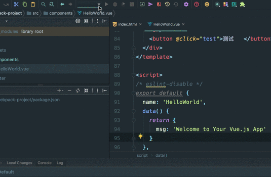
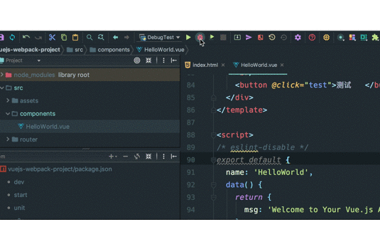
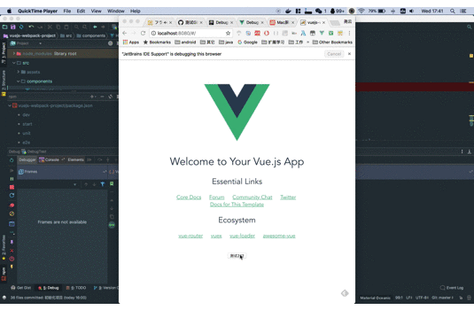

Vue项目其实是可以调试的，刚接触Vue项目开发时，在网上搜了一堆关于Vue项目调试的资料，发现网上都说比较难搞，也没有一个方案能走得通。都快要放弃了，后来试验了Vue官方推荐的使用vscode+chrome的调试方案，发现其实是可以走得通的。并且WebStorm+chrome也可以调试Vue项目。

我最喜欢的前端开发IDE还是IDEA家族的WebStorm，网上也是各种说不可以使用WebStorm+Chrome进行调试，后来在官网看到WebStorm+Chrome其实可以调试React应用，理论上来说React应用也是使用webpack打包，如果React可以用WebStorm+Chrome进行调试，那么Vue应用应该也可以，最终通过官方指引实验了一下WebStorm+Chrome调试Vue应用，发现其实是可以行的通的。

# Vue项目调试总结

## 理想的调试环境

理想的调试环境应该能支持如下工作方式:

1. 编写代码

2. 一键启动调试环境

3. 发现问题， 然后在开发代码的IDE中， 源代码中可能出错的行打好断点

4. 在浏览器中再次尝试上次出错的操作，浏览器进入中断状态，在开发的IDE中可看到中断状态，并且代码执行停留在打断点的地方

5. 此时可用各种快捷键来跟踪执行步骤，比如跳进 跳出 下一行，恢复运行等调试操作， 还可以看到函数调用堆栈，变量值，还可以执行表达式，通过这些操作可以定位到问题的本质原因

6. 定位到问题的本质原因后，然后修改源代码后，再在浏览器中操作，复现上一次问题，如果此时先前设置的断点还能生效，这样会最好

## 3种调试方式

试验过的3种调试方案对比:

1.  WebStorm + Chrome

2.  Visual Studio Code调试 

3.  Chrome直接调试

### WebStorm + Chrome

WebStorm是我最喜欢的前端开发IDE，只是比较重量级，启动速度较慢，但是它的代码跳转功能相比Visual Studio Code更强大，比如它能识别Vue的template中的函数调用，所以可以通过快捷键直接跳转到函数定义的地方
    
Visual Studio Code所拥有的emmet, snippet等特性 WebStorm都有

而在调试方面WebStorm + Chrome进行调试时，可以在WebStorm中源代码处加断点，当代码执行到断点处时，系统会让WebStorm显示在最前面，并且显示代码已运行到断点处，可以直接在代码处显示各个变量的值，也可以使用表达式计算值，能看到函数调用堆栈，通过这些操作可以快速定位到问题本质原因

此时如果修改代码，Vue应用会自动重新构建，但是此时断点和chrome中的代码就对应不上了，必须在Chrome中刷新页面才能对应上，然后可以尝试上次出问题的操作，继续定位问题，直至问题解决

但是在调试时请**注意**:

在WebStorm中启动调试时，WebStorm会根据你设置的url，自动打开新的Chrome浏览器进程访问这个设置的url，而且这个浏览器页面和你平常看到的浏览器差异会比较大，看不到书签栏，也看不到你先前所装的所有插件。这是因为平常我们打开Chrome浏览器进程时，并不会添加--remote-debugging-port选项，而WebStorm无法让已经打开的Chrome实例支持调试，所以必须重新打开一个新的Chrome浏览器进程，而且不能和原来的Chrome浏览器进程使用相同的用户数据文件夹，所以它会使用一个临时的文件夹，因此当它开始调试时看到的Chrome没有任何标签，也没有任何安装的插件。我们可以在这个浏览器上登录我们的google账号，然后将所有数据同步过来，这样下次调试时所有的书签和安装的应用也就都会存在了。我们也就可以将原来浏览器的数据导出到新的文件夹，然后在WebStorm中设置Chrome的用户数据文件夹为这个新的文件夹，这样也能将所有的书签和安装的应用导过来

另外一个**注意点**:

Web项目的调试和我们平常调试Java项目，安卓项目并不同，因为我们开发Vue项目时，使用webpack-dev-server，也就是说不是WebStorm自带的Server，此时需要先启动Server(可以使用命令行`npm run dev`，也可以通过在ide的Npm Script管理器中双击启动Server)，然后才能启动调试器。 平常我们调试Java项目或者安卓项目时都是一键启动的，而调试Web项目是需要两步的，当然我们可以在配置JavaScript Debug时，添加前置步骤来简化操作步骤

WebStorm还支持调试异步代码，Web Workers和 Service Workers

### Visual Studio Code + Chrome

Visual Studio Code + Chrome 也可以调试，也能支持在Visual Studio Code源代码处加断调试，当代码执行流运行到这个地方后，也会中断暂停运行，并在调试窗口显示本地变量的值以及堆栈，还可以在Debug Console里执行表达式

但是总体来说 Visual Studio Code + chrome进行调试，还是没有WebStorm舒服，因为WebStorm会在源代码函数中显示各个变量的值，显得清晰很多

### Chrome 直接调试

在Chrome中也可以打开调试窗口，找到source，然后在源代码处打断点，当代码执行到断点处也会暂停执行，然后有一个很小的窗口显示环境变量的值

总体来说在Chrome中直接调试的舒服度是最差的，因为Chrome的调试窗口会很小，局部变量的值也没法完全显示，主要原因其实是Chrome用了很大的窗口来展示页面，留给调试窗口的空间就很小了

## 如何使用WebStorm + Chrome调试Vue应用

### 准备环境

1.  在chrome中安装插件 [JetBrains IDE Support](https://chrome.google.com/webstore/detail/jetbrains-ide-support/hmhgeddbohgjknpmjagkdomcpobmllji)

2.  创建demo项目`vue init webpack vuejs-webpack-project`

3.  修改source map

    打开config/index.js文件, 修改source map属性，从cheap-module-eval-source-map改为source-map

    ```javascript
    'use strict'
    module.exports = {
      dev: {
        /**
        * Source Maps
        */
        // https://webpack.js.org/configuration/devtool/#development
        // devtool: 'cheap-module-eval-source-map',
        devtool: 'source-map',
        // ...
      },

      build: {
        //...
      }
    }
    ```

4.  添加测试代码 修改src/components/HelloWorld.vue

    ```vue
    <template>
    <div class="hello">
      <!-- .... -->
    <br/>
    <button @click="test">测试222</button>
    </div>
    </template>
    <script>
    export default {
    name: 'HelloWorld',
    //... 
    methods: {
    test(params) {
      console.log('hello bbb 222 33 ccc')
    }
    }
    }
    </script>
    // ...   
    ```

5.  在test函数中打好断点      

6.  使用npm install安装好所有依赖的组件

### 调试

1.  编辑调试配置，新建JavaScript调试配置，并设置要访问的url，以及Remote url配置，如下图所示:
    
    

    在URL处填写: http://localhost:8080

    在src的Remote url处填写: webpack:///src

    保存好调试配置

2.  启动server，可以使用WebStorm npm scripts中双击start启动server， 也可以在命令行中执行命令npm run start启动server

3.  点击debug，调试DebugTest，这时候会打开chrome，如下图所示   :

    

4.  当我们在chrome中点击测试按钮，WebStorm就会响应断点状态，如下图所示:

    

## 总结

目前我最喜欢的Vue项目调试方式还是: WebStorm+Chrome，因为WebStorm的代码编辑，重构等功能本来就很强大，调试时的的变量显示也是最友好的。只是WebStorm会比较重，启动较慢，但是功能最强大。VSCode+Chrome调试功能会稍微逊色一些，但是也基本可用，比较轻量级，启动速度较快。如果经常切换项目，可以考虑使用VSCode+Chrome的调试方式。

下一篇文章会介绍如何使用VSCode+Chrome进行调试

## 参考链接

1.  [https://www.jetbrains.com/help/webstorm/debugging-javascript-in-chrome.html](https://www.jetbrains.com/help/webstorm/debugging-javascript-in-chrome.html)

2. [https://vuejs.org/v2/cookbook/debugging-in-vscode.html](https://vuejs.org/v2/cookbook/debugging-in-vscode.html)
