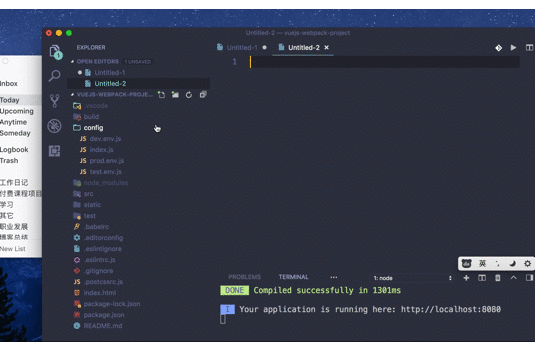
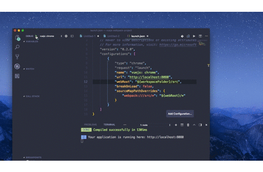

上一篇文章介绍了如何使用WebStorm+Chrome调试Vue应用，本篇介绍如何使用VSCode+Chrome调试Vue应用

# Vue项目调试总结

## 如何使用VSCode + Chrome调试Vue应用

### 准备环境

1.  在VSCode中安装插件[Debugger for Chrome](https://marketplace.visualstudio.com/items?itemName=msjsdiag.debugger-for-chrome)

2.  创建demo项目`vue init webpack vuejs-webpack-project`

3.  修改source map

    打开config/index.js文件, 修改source map属性，从cheap-module-eval-source-map改为source-map

    ```javascript
    'use strict'
    module.exports = {
      dev: {
        /**
        * Source Maps
        */
        // https://webpack.js.org/configuration/devtool/#development
        // devtool: 'cheap-module-eval-source-map',
        devtool: 'source-map',
        // ...
      },

      build: {
        //...
      }
    }
    ```

4.  添加测试代码 修改src/components/HelloWorld.vue

    ```vue
    <template>
    <div class="hello">
      <!-- .... -->
    <br/>
    <button @click="test">测试222</button>
    </div>
    </template>
    <script>
    export default {
    name: 'HelloWorld',
    //... 
    methods: {
    test(params) {
      console.log('hello bbb 222 33 ccc')
    }
    }
    }
    </script>
    // ...   
    ```

5.  在test函数中打好断点      

6.  使用npm install安装好所有依赖的组件

### 调试

1.  打开调试视图，编辑调试配置，如下图所示:

    

    配置如下所示:

    ```json
    {
        //...
        "version": "0.2.0",
        "configurations": [
            {
                "type": "chrome",
                "request": "launch",
                "name": "vuejs: chrome",
                "url": "http://localhost:8080",
                "webRoot": "${workspaceFolder}/src",
                "breakOnLoad": false,
                "sourceMapPathOverrides": {
                    "webpack:///src/*": "${webRoot}/*"
                }
            }
        ]
    }        
    ```

2.  启动server，可以使用WebStorm npm scripts中双击start启动server， 也可以在命令行中执行命令npm run start启动server

3.  点击debug，调试vuejs: chrome，这时候会打开chrome，当我们点击测试按钮VS Code, VS Code就会响应断点状态，如下图所示   :

    

## 总结

目前我最喜欢的Vue项目调试方式还是: WebStorm+Chrome，因为WebStorm的代码编辑，重构等功能本来就很强大，调试时的的变量显示也是最友好的。只是WebStorm会比较重，启动较慢，但是功能最强大

VSCode+Chrome调试功能会稍微逊色一些，但是也基本可用，比较轻量级，启动速度较快。如果经常切换项目，可以考虑使用VSCode+Chrome的调试方式

## 参考链接

1.  [https://www.jetbrains.com/help/webstorm/debugging-javascript-in-chrome.html](https://www.jetbrains.com/help/webstorm/debugging-javascript-in-chrome.html)

2. [https://vuejs.org/v2/cookbook/debugging-in-vscode.html](https://vuejs.org/v2/cookbook/debugging-in-vscode.html)
