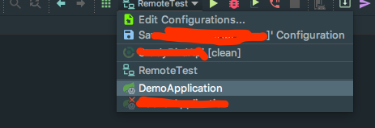

如果可以调试运行在跳板机(防火墙)后的Java服务，那么可快速定位Java服务问题的本质原因，从而解决这个问题。本篇分享的就是这样的一个方法。

## 背景

开发微信生态的后台服务时，要求后台服务必须部署在公网可访问的服务器上。这就要求我们在本机开发，然后在公网部署。为了定位问题原因，我们需要不停的在代码中加日志然后提交代码，然后在服务器上拉代码重新部署，效率十分低下。

有一种解决办法是在连到服务器的终端上使用jdb直接调试java进程，但是使用jdb打断点的效率很低，因为每次都要找到类全名以及代码行号来打断点，看变量值也很不方便。

最高效的解决办法还是使用idea来调试运行在服务器上的java进程，如果能直接访问服务器的所有端口，那还比较容易操作，但是如果服务器是躲在跳板机后，或者防火墙后，那就比较蛮烦。

本篇会告诉你如何利用ssh的本地端口转发来调试躲在跳板机后的服务器上的Java进程


## 原理


## 步骤

### 1. 登录跳板机时添加本地端口转发参数

```bash
ssh -l $JUMP_SERVER_USER -L 5005:$SERVER_IP:5005 -p $JUMP_SERVER_PORT $JUMP_SERVER_IP 
```

其中
1. JUMP_SERVER_USER是跳板机账号，
2. SERVER_IP是服务器的ip，跳板机通过该ip可连接到服务器
3. JUMP_SERVER_PORT 是指跳板机的ssh端口
4. JUMP_SERVER_IP 是指跳板机的ip

开发机不可直接访问服务器，必须通过跳板机才能连接上 

### 2. 登录Java服务所在的服务器

```bash
ssh -l $USER_NAME $SERVER_IP
```

其中:

1. USER_NAME是指Java服务所在的服务器的用户名

2. SERVER_IP是指服务器的ip 一般都是局域网ip

### 3. 使用调试的方式启动Java进程

```bash
java -Xdebug -Xrunjdwp:transport=dt_socket,server=y,suspend=n,address=5005  -jar ./build/libs/XXX.jar
```

只有使用调试的方式启动java进程，才能使用调试器连接到这个java进程，本篇示例是在5005端口监听调试请求

### 4. 在idea创建远程调试的profile




### 5. 调试


可以看到调试窗口变成了这样:


